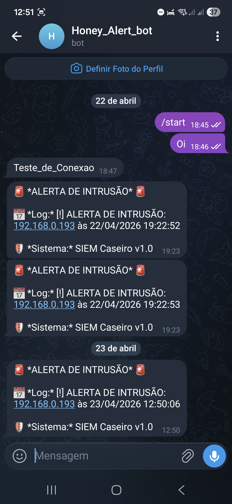

## 📸 Demonstração em Tempo Real

Para validar o sistema, realizei um teste de intrusão simulado. Abaixo, você pode ver o fluxo completo:

### 1. A Armadilha (Visão do Atacante)
O HoneyPot simula uma tela de aviso de segurança corporativa para registrar qualquer tentativa de acesso não autorizado.

### 2. O Monitoramento (Visão do Sistema)
No momento do acesso, o HoneyPot gera o log e o **Log Analyser** detecta a atividade instantaneamente, processando os dados e disparando o alerta via API.

### 3. O Alerta (Visão do Analista)
Em menos de um segundo, a notificação detalhada chega ao dispositivo móvel do administrador através do Telegram.

